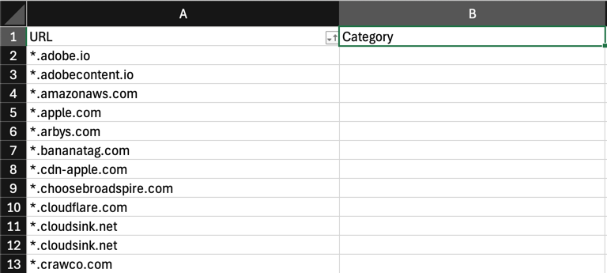
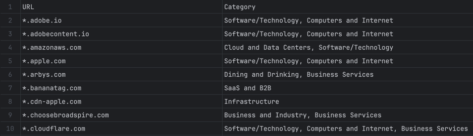

# Domain Categorization Script

This Python script automates the task of categorizing domains listed in an Excel file by using the Cisco Umbrella Investigate API.

## Requirements
- Python 3.9 or greater
- Umbrella Investigate Access Token
- Git

## Summary

### 1. Primary Functions
#### a. `get_domain_categorization(domain)`
- Fetches the content categorization of a given domain using Cisco Umbrella Investigate API.
- **Inputs**:
  - A domain name (e.g., `example.com`).
- **Outputs**:
  - A dictionary containing the API response in JSON format.
- **Process**:
  - Retrieves the API access token from an environment variable (`INVESTIGATE_ACCESS_TOKEN`).
  - Sends an HTTP GET request to the Umbrella API endpoint.
  - Returns the domain's categorization if the request is successful or raises an error if it fails.

#### b. `update_categories_in_excel(file_path)`
- Updates an Excel file by categorizing domains listed in its 'URL' column and writing their categories in the 'Category' column.
- **Inputs**:
  - Path to the Excel file (e.g., `url.xlsx`).
- **Outputs**:
  - None (it updates the Excel file in place).
- **Process**:
  - Opens the Excel file using `openpyxl` and identifies the 'URL' and 'Category' columns.
  - Iterates through each domain in the 'URL' column, sends it to the `get_domain_categorization` function, and retrieves its content categories.
  - Writes the categories back into the corresponding 'Category' column.
  - Handles errors gracefully by recording them in the 'Category' column.

---

### 2. Key Steps
- **Environment Setup**:
  - The script requires an API access token stored in the `INVESTIGATE_ACCESS_TOKEN` environment variable.
- **Excel File Requirements**:
  - The Excel file must have a 'URL' column (containing domain names) and a 'Category' column (to store the results).
- **Domain Processing**:
  - Removes any leading `*.` from domain names before sending them to the API.
- **Error Handling**:
  - Records any errors (e.g., missing token or failed API requests) in the 'Category' column.

---

### 3. Example Usage
Before running the script, make sure the `INVESTIGATE_ACCESS_TOKEN` environment variable is set with a valid API token.

```bash
python check.py
```

## Instructions

1. Clone this repository.

  ```bash
  git clone https://github.com/emcnicholas/check_url_categories.git
  ```

2. Create and activate a Python virtual environment.

   - Mac
     ```python
     python3 -m venv myenv
     source myenv/bin/activate
     ```
   - Windows

     ```python
     python -m venv myenv
     myenv\Scripts\activate
     ```
    
3. Install requirements.

  ```python
  pip install -r requirements.txt
  ```

4. Set the `INVESTIGATE_ACCESS_TOKEN` environment variable.

  ```bash
  export INVESTIGATE_ACCESS_TOKEN=<<<YOUR_TOKEN>>>
  ```

5. Create or upload a file named `url.xlsx`. This file must have a URL and Category column.

  

6. Run the Python script.

  ```bash
  python check.py
  ```

7. The category column will now be populated with the Domain/URL category.




